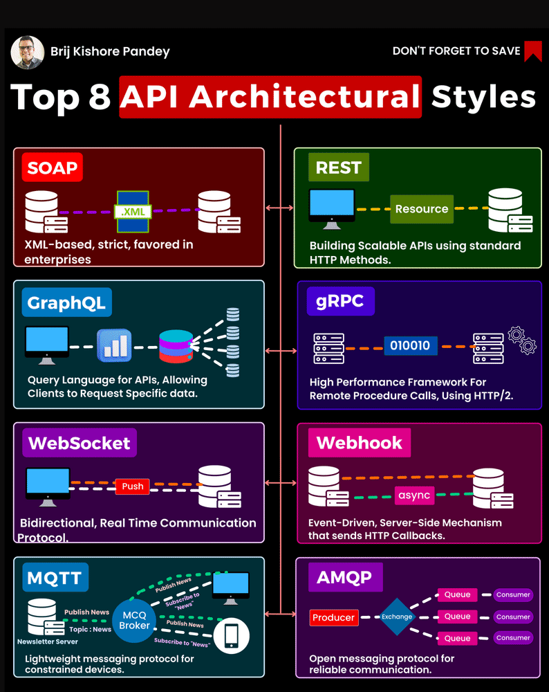

# API Implementation with Django

- [API Implementation with Django](#api-implementation-with-django)
  - [API Design Types](#api-design-types)
  - [REST API](#rest-api)
    - [Introduction](#introduction)
    - [History of Rest API](#history-of-rest-api)
    - [Features of REST API](#features-of-rest-api)
    - [Principals of REST API](#principals-of-rest-api)
    - [Methods of REST API](#methods-of-rest-api)
    - [Rest API Examples](#rest-api-examples)
    - [Conclusion](#conclusion)
    - [Frequently Asked Questions (FAQ)](#frequently-asked-questions-faq)
    - [References:](#references)
  - [GraphQL API](#graphql-api)
    - [Introduction](#introduction-1)
    - [History of GraphQL](#history-of-graphql)
    - [Features of GraphQL](#features-of-graphql)
    - [Principal of GraphQL](#principal-of-graphql)
    - [Methods of GraphQL](#methods-of-graphql)
    - [Rest API Examples](#rest-api-examples-1)
    - [Conclusion](#conclusion-1)
    - [Frequently Asked Questions](#frequently-asked-questions)
    - [References](#references-1)
  - [Resources](#resources)

## API Design Types

1. REST
2. SOAP
3. GraphQL
4. gRPC
5. MQTT
6. WebSockets
7. Webhooks
8. AMQP

**API Design Types Details**

1. **REST**:  
   Resource based for Web Servers  
   **Use Case:**
    - Financial Services
    - Payment gateway

2. **SOAP**:   
   XML-based for Enterprise Applications  
   **Use Case:**
    - Realtime data

3. **GraphQL**:
   Query Language reduce network load

   **Use Case:**
    - Faster query language

4. **gRPC**:  
   High Performance for microservices

   **Use Case:**
    - Realtime data

5. **MQTT**:

6. **WebSockets**:  
   Bidirectional for low-latency data exchange

   **Use Case:**
    - Live Chat Application
    - Gaming

7. **Webhooks**:  
   Asynchronous for event-driven application

   **Use Case:**
    - Realtime data

8. **AMQP**:

## REST API

### Introduction

To communicate, software applications use Application Programming Interfaces or APIs. APIs allow two programs to share
data consistently. Your eCommerce site may connect with payment software, shipping software, and other essential
integrations via their APIs. There are several techniques for developing an API, but if you want to integrate software
into your product, you need to know what is REST API.

### History of Rest API

There was no agreement on how to develop or use an API before 2000. Protocols like Simple Object Access Protocol (SOAP),
which were notoriously difficult to build, administer, and debug, were required for its integration.

APIs were then developed to be adaptive rather than accessible. After realizing the true potential of Web APIs in 2000,
things started to shift: Roy Fielding and a team of experts created Representational State Transfer or REST,
irreversibly altering the API landscape. The objective was to create a standard that would allow two servers to
communicate and exchange data from anywhere in the world. As a result, they created REST, a resource-oriented
architecture that includes the following concepts, attributes, and constraints:

- Interface uniformity
- Client/server architecture
- No state or session retention
- Resource representation caching
- Usage of the HTTP protocol and its methods

### Features of REST API

We have understood what is Rest API, and how it works. Now, we will see the features of Rest API.

* Scalability: Development teams may quickly scale the solution due to the separation of client and server.*
  Flexibility & Portability: Data from one of the queries must be accurate for REST-style APIs; thus, it is conceivable
  to
  transition from one server to another. It is also possible to alter the database at any moment.* Independence: Through
  the isolation of the
  client and server, the
  protocol allows for
  autonomous development
  across a project. REST
  APIs are also adaptive
  to the working syntax
  and platform, enabling
  you to test many
  environments
  simultaneously while
  building.

### Principals of REST API

- **Client-Server Decoupling**  
  In REST API design, client and server applications must be completely independent of each other. The only information
  the client application should know is the URI of the requested resource; it can't interact with the server application
  in any other ways. Similarly, a server application shouldn't modify the client application other than passing it to
  the requested data via HTTP.
- **Uniform Interface**    
  All API requests for the same resource should look the same, no matter where the request comes from. The REST API
  should ensure that the same piece of data, such as the name or email address of a user, belongs to only one uniform
  resource identifier (URI). Resources shouldn’t be too large but should contain every piece of information that the
  client might need.
- **Statelessness**  
  REST APIs are stateless, meaning that each request needs to include all the information necessary for processing it.
  In other words, REST APIs do not require any server-side sessions. Server applications aren’t allowed to store any
  data related to a client request.
- **Layered System Architecture**  
  In REST APIs, the calls and responses go through different layers. As a rule of thumb, don’t assume that the client
  and server applications connect directly to each other. There may be a number of different intermediaries in the
  communication loop. REST APIs need to be designed so that neither the client nor the server can tell whether it
  communicates with the end application or an intermediary.
- **Cacheable**  
  When possible, resources should be cacheable on the client or server side. Server responses also need to contain
  information about whether caching is allowed for the delivered resource. The goal is to improve performance on the
  client side, while increasing scalability on the server side.

- **Code-On-Demand**  
  REST APIs usually send static resources, but in certain cases, responses can also contain executable code (such as
  Java applets). In these cases, the code should only run on-demand.

### Methods of REST API

Challenges of using Rest API

1. **REST endpoint consensus:** It makes little difference how you style your URLs, but consistency across your API is essential. Unfortunately, as procedures get more complicated, the number of possible possibilities grows even more significant. As a result, consistency on huge codebases with multiple developers can be challenging.
2. **REST API Versioning:** APIs are frequently versioned to avoid compatibility difficulties. However, old endpoints remain alive, increasing effort due to the maintenance of numerous APIs.
3. **REST API authentication:** API authentication will differ based on the circumstance. It treats the third-party programs as logged-in users with specified privileges and permissions. Registered users can also utilize third-party programs to access their data, such as searching for emails or documents.
4. **REST API Security:** Even though RESTful APIs make it easier to access and change your application, security vulnerabilities might arise. A client, for example, can submit hundreds of requests per second and destroy your server.
5. **Multiple Requests and Unnecessary Data:** A response may contain more information than you require or require additional queries to get all the data.

### Rest API Examples

Now that you are clear about REST API's meaning, let us know what REST API examples are.

- **Twitter**: Twitter API permits third-party applications to access and write data from Twitter. Write and post tweets,
  share tweets, and read profiles using it. This API is handy for obtaining and analyzing massive quantities of tweets
  regarding certain subjects.
- **Instagram**: The Instagram Basic Display API provides access to user profiles, images, and videos. You may use this API
  and others to create applications that pull user data and integrate it into your product. Instagram also provides a
  Graph API for professional Instagram accounts to manage online activity.- Spotify:Spotify's web API lets customers
  obtain information about artists, songs, albums, and playlists on the Spotify
  platform. You may also use it to create playlists, stop and play music, shuffle tracks, and do various other things.
- **HubSpot**: All of HubSpot's APIs follow REST principles and are built for comprehensive integrations to help
  organizations get the most out of HubSpot's products. You can extend HubSpot's sophisticated marketing software with
  additional features and link your HubSpot account with other valuable applications.

### Conclusion

This article taught us about what is REST, API, and RESTful API principles. We've looked at REST API, what REST API is
used for, and how to use it. REST API interaction methods are a pretty comprehensive notion with no explicit
specifications. Finally, we discovered that REST API is an architectural style employed for component interactions
rather than a standard in and of itself.

### Frequently Asked Questions (FAQ)

1. **What is the use of REST API?**  
   A RESTful API is an architectural approach for an application program interface (API) that accesses and utilizes data
   via HTTP requests. It may use that data to GET, PUT, POST, and DELETE data, which correspond to reading, modifying,
   creating, and removing resource-related activities.
2. **What is the difference between REST API and API?**  
   REST (Representational State Transfer) is the API that uses a set of rules to communicate between applications and
   servers.
3. **What is the URL in REST API?**  
   An API URL Path is a URL that allows you to access an API's numerous functionalities. Using one is as easy as
   entering any URL into your web browser.
4. **How to design a REST API?**  
   The most common methods to design are GET, POST, PUT, and DELETE.
5. **What is the difference between SOAP and REST API?**  
   SOAP solely utilizes XML for sharing information in its message format, but REST is not limited to XML and allows the
   implementer to choose which Media-Type to use, such as XML, JSON, or plain text. Furthermore, whereas REST may
   utilize the SOAP protocol, SOAP cannot use REST.
   SOAP solely utilizes XML for sharing information in its message format, but REST is not limited to XML and allows the
   implementer to choose which Media-Type to use, such as XML, JSON, or plain text. Furthermore, whereas REST may
   utilize the SOAP protocol, SOAP cannot use REST.

### References:

- https://www.knowledgehut.com/blog/programming/rest-api
- https://medium.com/bytebytego-system-design-alliance/best-practice-and-cheat-sheet-for-rest-api-design-6a6e12dfa89f
- https://www.ibm.com/topics/rest-apis
- https://www.youtube.com/watch?v=1Wl-rtew1_E
- https://simpleisbetterthancomplex.com/tutorial/2018/12/19/how-to-use-jwt-authentication-with-django-rest-framework.html

## GraphQL API

### Introduction
GraphQL is a query language for APIs and a runtime for fulfilling those queries with your existing data. GraphQL provides a complete and understandable description of the data in your API, gives clients the power to ask for exactly what they need and nothing more, makes it easier to evolve APIs over time, and enables powerful developer tools.    
### History of GraphQL
GraphQL was developed by Facebook in 2012 and released as an open-source project in 2015. It was originally created to address limitation and shortcomings of REST.

GraphQL allows clients to define the structure of the data they need, and servers to respond with exactly that data, without any unnecessary data. It’s often used as an alternative to RESTful APIs, particularly for scenarios where the client needs fine-grained control over the data that’s returned.

### Features of GraphQL
The following terms are often used when interacting with GraphQL. Knowing them can be helpful, though we won’t be covering all of them in this tutorial.

- **Schema**: Describes the functionality available to the client applications that connect to it.
- **Query**: A schema type that represents the GET request and defines the operations that can be used for reading or fetching data.
- **Nesting**: Queries can be nested inside of other queries.
- **Mutation**: A schema type that represent POST,PUT,DELETE requests and defines operations that can be used for modifying the data.
- **Subscription**: Notifies the client server in real time about updates to the data.
- **Resolver**: Functions that return values for fields associated with existing schema types.

### Principal of GraphQL
### Methods of GraphQL
### Rest API Examples
### Conclusion
### Frequently Asked Questions
### References
- https://www.codecademy.com/article/smyja/how-to-use-graphql-with-django

## Resources
